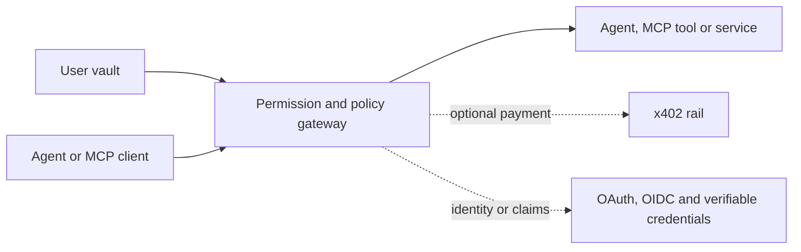

# Agent Capability Middleware

The open TypeScript SDK for letting an agent buy one exact x402 resource under a bounded user grant, without receiving a wallet private key or unrestricted spending authority.

> Developer preview. The SDK is usable today; the included server is an in-memory reference implementation and must not be used with real personal data or funds.

## Why this exists

MCP lets agents call tools. OAuth/OIDC can identify clients and users. Verifiable credentials can carry trusted claims. x402 can carry payment requirements and proofs. None of those standards alone decides what an agent may know, do, delegate or spend for a particular user.

Agent Capability Middleware composes those existing standards behind a capability and policy layer. It does not replace them or introduce a new transport protocol.



## Current MVP path

The first supported workflow is intentionally narrow:

```text
Agent -> bounded ACM grant -> protected testnet payer -> paid Omni resource
      -> fresh typed response + settlement receipt + policy audit
```

The canonical product is Omni Terminal's composite BTC market-risk snapshot at `0.003` Base
Sepolia USDC. It combines live Hyperliquid market state with current enriched news. The SDK pins
the expected amount, network, asset and payee and delegates signing to a protected ACM gateway.

Run the complete partner preflight without a gateway or payment:

```bash
git clone https://github.com/InTheta/agent-capability-middleware.git
cd agent-capability-middleware
npm ci
npm run partner:check
```

This packs and installs the SDK into a temporary external project, verifies its x402 surface,
checks the canonical Omni catalog entry and writes a redacted `.acm-design-partner-report.json`.
The funded path uses the same command but remains explicitly opt-in and is documented under
[x402 integration](docs/x402-integration.md).

## Run the secondary local reference lifecycle

Requirements: Node.js 20 or 22.

```bash
git clone https://github.com/InTheta/agent-capability-middleware.git
cd agent-capability-middleware
npm ci
npm run quickstart
```

This synthetic, in-memory quickstart demonstrates the broader capability lifecycle. It is not the
MVP release gate. It:

1. parses an Amazon-shaped order CSV locally;
2. uploads aggregate shopping signals, not raw rows;
3. creates unconfirmed memory candidates;
4. proves an agent cannot read an unconfirmed preference;
5. confirms the candidate as the user;
6. returns only the specifically granted attribute;
7. revokes the grant and proves the next read is denied.

## Install the SDK

Until the first npm release, install the current GitHub package:

```bash
npm install github:InTheta/agent-capability-middleware#main
```

```ts
import { AgentCapabilityClient } from "@agent-capability-middleware/sdk";

const acm = new AgentCapabilityClient("https://gateway.example.com", {
  apiKey: process.env.ACM_API_KEY,
});

const agent = await acm.registerAgent({
  name: "Shopping Assistant",
  developerId: "developer_example",
});

const grant = await acm.createGrant({
  userId: "user_example",
  agentId: agent.id,
  scopes: ["attributes.preferences.shopping.brands.read"],
  deniedScopes: ["cookies.*", "identity.*", "medical.*"],
  expiresInSeconds: 600,
});
```

## Secondary experiment: privacy-safe shopping learning

```ts
import {
  createShoppingEvidenceImportRequest,
  parseShoppingOrderCsv,
} from "@agent-capability-middleware/sdk";

const preview = parseShoppingOrderCsv(await file.text(), {
  source: "amazon_order_history_export",
});

// Display preview.signals for the user's review before upload.
await acm.importShoppingEvidence(
  createShoppingEvidenceImportRequest("user_example", preview),
);
```

The parser does not read cookies. It does not include order IDs, addresses, payment details or raw product titles in the import request. Potentially sensitive purchase categories are excluded, and all learned attributes remain pending until confirmed.

## x402 boundary

The SDK can inspect x402 resources and call a compatible gateway's bounded payment endpoints. Its typed `consumeX402Testnet<T>()` method returns the paid body, receipt, and policy result so an agent can validate the seller's schema and freshness before acting. It never accepts or stores a private key. A production gateway must bind payment approval to the exact resource, amount, network, recipient, purpose and idempotency key before a separately configured wallet signs.

Omni Terminal is the first real external-service example. Six canonical paid route forms now cover
enriched news, public trader profiles, liquidation maps, trader rankings and composite market
risk. All have completed Base Sepolia settlement and are cataloged in CDP Bazaar. Run the opt-in example only
against a protected, funded ACM gateway:

```bash
ACM_GATEWAY_URL=http://127.0.0.1:8787 \
ACM_CONFIRM_TESTNET_SPEND=yes \
npm run partner:check
```

Without the explicit confirmation variable, the example performs only a keyless lookup of Omni's receiving address in CDP Bazaar. Developers can also call `searchCdpX402Bazaar` or `listCdpX402MerchantResources` directly. The funded path is intentionally excluded from `npm run verify` and CI because it may spend test USDC. The stable Omni URL also requires its path-scoped Cloudflare Access application; see [x402 integration](docs/x402-integration.md).

To smoke all live query shapes with an explicit `0.025` test-USDC budget:

```bash
ACM_GATEWAY_URL=http://127.0.0.1:8787 \
ACM_CONFIRM_CATALOG_TESTNET_SPEND=yes \
npm run example:omni-catalog
```

The generic `payQuotedX402` method also supports a compatible gateway's mainnet approval flow.
It never receives a private key. Mainnet status and live read-only balances are available through
`getMainnetWalletStatus()` and `getMainnetWalletBalances()`.

## Repository map

- `src/` — dependency-light TypeScript SDK and local evidence parser.
- `examples/` — end-to-end external-consumer flow and non-production reference server.
- `docs/` — developer guides, architecture and public roadmap.
- `specs/` — versioned implementation profiles for capabilities, audit and x402 policy binding.
- `tests/` — privacy and package contract checks.

## Public versus hosted components

Open here:

- SDK and types;
- privacy-safe local importers;
- public implementation profiles;
- reference examples and tests.

Not included:

- hosted multi-tenant vault;
- production identity verification integrations;
- custody or funded-wallet keys;
- fraud/risk engine;
- enterprise policy control plane;
- production connectors and operational configuration.

## Documentation

- [Getting started](docs/getting-started.md)
- [Architecture](docs/architecture.md)
- [Privacy-safe learning](docs/privacy-safe-learning.md)
- [SDK API](docs/sdk-api.md)
- [x402 integration](docs/x402-integration.md)
- [Controlled design-partner checklist](docs/design-partner-checklist.md)
- [Public roadmap](docs/roadmap.md)
- [Security policy](SECURITY.md)

Licensed under [Apache-2.0](LICENSE).
