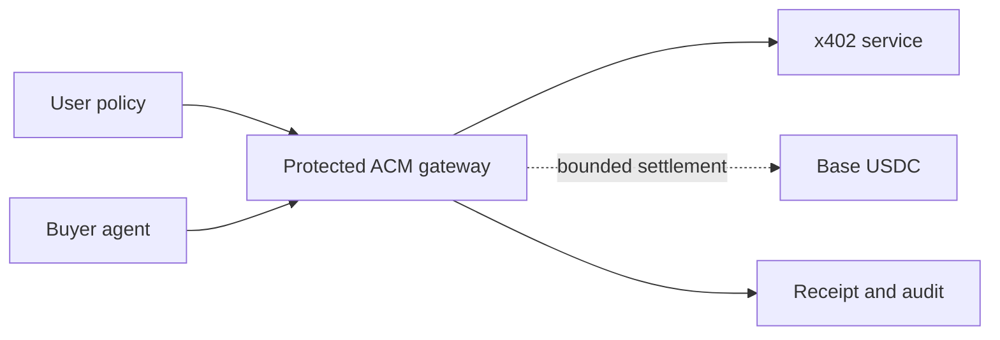

# Agent Capability Middleware

Give an AI agent permission to buy **one exact x402 resource** under a bounded grant—without giving the agent a wallet key.

**x402 moves money; ACM governs authority.**

> Developer preview. The protected buyer flow is implemented and tested on Base Sepolia. Seller and data-exchange helpers are experimental local previews; they do not settle payments or prove buyer demand.

## 60-second no-spend check

Requirements: Node.js 20+ and internet access. No clone, account, wallet, or private key is required.

```bash
npx --yes https://github.com/InTheta/agent-capability-middleware/archive/refs/tags/v0.1.0-preview.18.tar.gz partner-check \
  > acm-no-spend-report.json
```

Success means the report contains:

```json
{
  "ok": true,
  "mode": "no_spend",
  "packageInstall": "installed_cli",
  "secretsIncluded": false
}
```

The check reads Coinbase's public x402 Bazaar catalog, confirms all seven canonical Omni routes, and validates the `0.003` Base Sepolia USDC quote. It creates no signature or payment.

## Five-minute local demo

```bash
npx github:InTheta/agent-capability-middleware#main demo buyer
```

The deterministic demo creates a bounded grant, validates a fresh synthetic result, revokes the grant, and proves the next request is denied. Any `0xmock_...` receipt is deliberately not a chain transaction.

## Install as a dependency

```bash
npm install github:InTheta/agent-capability-middleware#main
```

```ts
import {
  AgentCapabilityClient,
  createOmniPaymentRequest,
  createOmniX402Recipe,
  requireFreshPaidResult,
} from "@agent-capability-middleware/sdk";

const acm = new AgentCapabilityClient(process.env.ACM_GATEWAY_URL!, {
  apiKey: process.env.ACM_API_KEY,
});

const recipe = createOmniX402Recipe({ kind: "market_risk", symbol: "BTC" });
const request = createOmniPaymentRequest(
  "grant_approved_by_user",
  recipe,
  crypto.randomUUID(),
);

const result = await acm.consumeX402Testnet(request);
const data = requireFreshPaidResult(result, { expectedSchema: recipe.schema });
```

The gateway—not the SDK or agent—holds the payer key. It checks the grant, exact URL, purpose, amount, network, asset, payee, expiry, idempotency key, approval state, and revocation state before settlement.

## Controlled paid test

After an ACM operator provides a protected gateway URL and confirms its dedicated testnet payer is funded:

```bash
export ACM_GATEWAY_URL='https://provided-gateway.example'
export ACM_CONFIRM_TESTNET_SPEND=yes
npx --yes https://github.com/InTheta/agent-capability-middleware/archive/refs/tags/v0.1.0-preview.18.tar.gz partner-check \
  > acm-paid-report.json
unset ACM_API_KEY ACM_CONFIRM_TESTNET_SPEND
```

If that deployment requires a workload key, enter it without placing it in shell history:

```bash
printf 'ACM API key: '; IFS= read -r -s ACM_API_KEY; printf '\n'; export ACM_API_KEY
```

The acceptance flow buys one current BTC market-risk result, requires a fresh schema-matched response and public receipt, revokes the grant, then proves a second settlement cannot occur. Return only the redacted report. See the [external developer checklist](docs/design-partner-checklist.md).

## What you can build now

| Goal | Command or guide | Status |
|---|---|---|
| Inspect live Bazaar routes without paying | `npx github:InTheta/agent-capability-middleware#main inspect` | Implemented |
| Build exact Omni news, trader, liquidation, and risk requests | `npx github:InTheta/agent-capability-middleware#main recipes` | Implemented |
| Buy through a protected, policy-bound payer | [Getting started](docs/getting-started.md) | Implemented on Base Sepolia |
| Charge agents for a developer API | `acm demo developer-seller` | Experimental local offer helper |
| Offer a user-confirmed minimum-disclosure capability | `acm demo user-seller` | Experimental local offer helper |
| Compare both offer types | `acm demo exchange` | Experimental local directory |

The seven canonical Omni templates cover targeted and market-wide AI news, exact time windows, liquidation views, trader rankings, public trader profiles, market risk, and a composite market snapshot. Recipe builders reuse those templates; they do not claim extra Bazaar listings.

## Architecture



MCP can carry tool calls, OAuth/OIDC can identify workloads and users, verifiable credentials can carry attestations, and x402 carries payment requirements and proofs. ACM composes existing standards rather than replacing them.

## Experimental seller previews

ACM also explores the other side of the market: a developer can describe a paid API, and a user can offer a confirmed, minimized capability under **Free, Paid, Ask, or Deny** policy. These helpers are useful for product design and local testing, but they are not yet hosted settlement, fulfilment, an auction, or a production data marketplace.

```bash
npx github:InTheta/agent-capability-middleware#main demo developer-seller
npx github:InTheta/agent-capability-middleware#main demo user-seller
npx github:InTheta/agent-capability-middleware#main demo exchange
```

See [runnable examples](docs/examples.md) and the [user seller preview](docs/user-seller-agent.md).

## Verify the repository

```bash
git clone https://github.com/InTheta/agent-capability-middleware.git
cd agent-capability-middleware
npm ci
npm run verify
```

Verification type-checks the SDK and a consumer, runs the test suite and privacy checks, exercises the examples, packs and installs the package in a clean temporary project, and checks the CLI and fresh-developer lifecycle.

## Boundaries

This repo contains the public SDK, request builders, local evidence minimizer, experimental offer helpers, examples, and tests. It does **not** contain private keys, a hosted vault, production identity verification, a live user-data marketplace, guaranteed user revenue, or a production fraud/risk control plane.

## Documentation

- [Five-minute getting started](docs/getting-started.md)
- [Runnable examples](docs/examples.md)
- [Omni agent recipes](docs/omni-agent-recipes.md)
- [SDK API](docs/sdk-api.md)
- [x402 integration](docs/x402-integration.md)
- [Architecture](docs/architecture.md)
- [Privacy-safe learning](docs/privacy-safe-learning.md)
- [Security](SECURITY.md)
- [Roadmap](docs/roadmap.md)

Apache-2.0 licensed.
