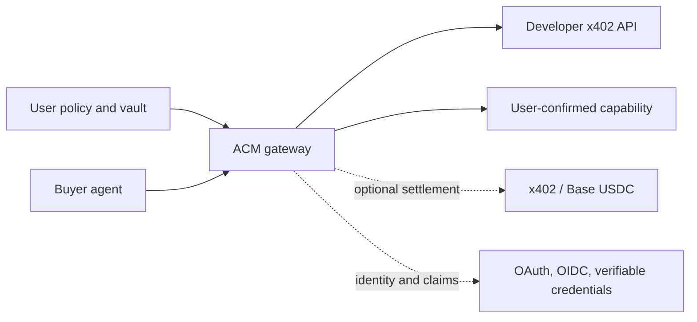

# Agent Capability Middleware

One small SDK for agents to buy data safely, developers to sell APIs, and users to control whether a minimum-disclosure capability is **Free, Paid, Ask, or Deny**.

> Developer preview. Buying through the protected ACM gateway is implemented. Seller and exchange helpers are an experimental, local fixed-price preview: they create and evaluate offers but do not custody keys, settle payments, or prove buyer demand.

**x402 moves money; ACM governs authority.**

## Try it without cloning

Requirements: Node.js 20 or newer. These commands use no wallet key and spend nothing.

```bash
npx github:InTheta/agent-capability-middleware#main demo buyer
npx github:InTheta/agent-capability-middleware#main demo developer-seller
npx github:InTheta/agent-capability-middleware#main demo user-seller
npx github:InTheta/agent-capability-middleware#main demo exchange
```

Inspect a real Bazaar-listed x402 service without paying:

```bash
npx github:InTheta/agent-capability-middleware#main inspect
npx github:InTheta/agent-capability-middleware#main recipes
```

`recipes` prints bounded request plans for targeted news, a 60-minute market briefing, exact news
windows, liquidation views, best/worst/largest/risk traders, public trader profiles, and the
composite market-risk and market-snapshot products. These reuse seven canonical route templates,
all funded and Bazaar-cataloged on Base Sepolia. Recipes do not create
or claim extra listings.

## External developer acceptance

The tester needs only Node.js 20+ and npm—not a clone or Git installation. One command installs the
pinned preview archive and checks the live canonical Bazaar contract without spending:

```bash
npx --yes https://github.com/InTheta/agent-capability-middleware/archive/refs/tags/v0.1.0-preview.18.tar.gz partner-check \
  > acm-no-spend-report.json
```

The JSON report must contain `"ok": true`, `"mode": "no_spend"`, all seven named canonical Omni routes, the
`0.003` Base Sepolia USDC quote, and `"secretsIncluded": false`.

After ACM provides controlled gateway access, the same installed command performs the funded
testnet acceptance. If that deployment enforces a workload key, enter it through a hidden prompt so
it is not written into shell history:

```bash
export ACM_GATEWAY_URL='https://provided-gateway.example'
export ACM_CONFIRM_TESTNET_SPEND=yes
npx --yes https://github.com/InTheta/agent-capability-middleware/archive/refs/tags/v0.1.0-preview.18.tar.gz partner-check \
  > acm-paid-report.json
unset ACM_API_KEY ACM_CONFIRM_TESTNET_SPEND
```

Only when the operator supplies a workload key, enter it before the command:

```bash
printf 'ACM API key: '; IFS= read -r -s ACM_API_KEY; printf '\n'; export ACM_API_KEY
```

Only the redacted report should be returned. See the
[external test script](docs/design-partner-checklist.md) for success criteria and feedback questions.

## Choose your job

| I want to… | Start here | Status |
|---|---|---|
| Let my agent buy one exact x402 result under a budget | `acm demo buyer` then [buyer quickstart](docs/getting-started.md#1-agent-buys-safely) | Implemented; live payment is opt-in |
| Build a real Omni news/trader/liquidation request | `acm recipes` then [agent recipes](docs/omni-agent-recipes.md) | Implemented request builders; payment remains gateway-controlled |
| Charge agents for my API | `acm demo developer-seller` | Experimental offer helper; seller still provides an x402 server |
| Let a user offer one confirmed capability | `acm demo user-seller` | Experimental local preview |
| See both offer types in one directory | `acm demo exchange` | Experimental local fixed-price preview |

## Install as a dependency

Until the first npm release:

```bash
npm install github:InTheta/agent-capability-middleware#main
```

### 1. Agent buys safely

The SDK sends intent and grant metadata to a protected gateway. It never receives a private key.

```ts
import {
  AgentCapabilityClient,
  createOmniPaymentRequest,
  createOmniX402Recipe,
  requireFreshPaidResult,
  type OmniMarketRiskResponse,
} from "@agent-capability-middleware/sdk";

const acm = new AgentCapabilityClient(process.env.ACM_GATEWAY_URL!, {
  apiKey: process.env.ACM_API_KEY,
});

const recipe = createOmniX402Recipe({
  kind: "market_risk",
  symbol: "BTC",
});
const result = await acm.consumeX402Testnet<OmniMarketRiskResponse>(createOmniPaymentRequest(
  "grant_approved_by_user",
  recipe,
  crypto.randomUUID(),
));

const data = requireFreshPaidResult(result, {
  expectedSchema: recipe.schema,
});
```

The gateway enforces the exact resource, price, network, asset, receiver, purpose, expiry, replay key, approval and revocation state.

### 2. Developer sells an API

```ts
import {
  createDeveloperServiceOffer,
  LocalCapabilityDirectory,
} from "@agent-capability-middleware/sdk";

const directory = new LocalCapabilityDirectory();
const offer = directory.publish(createDeveloperServiceOffer({
  developerId: "weather_builder",
  name: "Current delivery weather risk",
  description: "Fresh structured weather context for delivery agents.",
  capability: "api.weather.delivery_risk",
  purpose: "check_delivery_conditions",
  endpoint: "https://api.example.com/x402/weather-risk",
  terms: {
    policy: "paid",
    priceUsdc: 0.002,
    payTo: "0x1111111111111111111111111111111111111111",
    network: "eip155:84532",
  },
}));
```

This creates a discoverable policy object for the example. Your resource server still issues and settles the real x402 challenge. ACM controls which buyer agent may pay and why.

### 3. User sells one capability

```ts
import {
  createUserCapabilityOffer,
  LocalCapabilityDirectory,
} from "@agent-capability-middleware/sdk";

const directory = new LocalCapabilityDirectory();
directory.publish(createUserCapabilityOffer({
  userId: "user_123",
  name: "Running-shoe purchase intent",
  description: "A confirmed intent, not raw order history.",
  capability: "commerce.intent.running_shoes",
  purpose: "match_running_shoe_offer",
  confirmedByUser: true,
  projection: {
    category: "running_shoes",
    sizeBand: "UK_9_10",
    budgetBand: "GBP_70_110",
  },
  retention: "session",
  terms: {
    policy: "paid",
    priceUsdc: 0.01,
    payTo: "0x1111111111111111111111111111111111111111",
    network: "eip155:84532",
  },
}));
```

The preview accepts only low-risk commerce, shopping, food, or travel capabilities; requires explicit user confirmation; and rejects obvious cookie, session, secret, card, passport, licence, private-key, and raw-data fields. This is defence in depth, not a complete data-loss-prevention system.

## Why an agent would use ACM every day

- **Shopping:** request confirmed size, budget band, and brand preference instead of asking again or scraping a profile.
- **Travel:** buy a fresh disruption or weather result while sharing only the journey context needed for that request.
- **Trading:** buy current news, liquidation, or trader-profile data under a fixed per-call budget and reject stale output.
- **Delivery:** receive a coarse delivery area and an address-verification result without retaining a full identity profile.
- **Food:** use confirmed allergy and cuisine constraints for one restaurant search, with session-only retention.
- **Research:** route a question to a specialist paid API and leave a receipt tied to the exact purpose.
- **Commerce:** let a merchant agent pay for a user-confirmed purchase-intent projection instead of receiving browsing history.
- **Multi-agent work:** pass narrower authority to a specialist agent without forwarding the user’s wallet key or entire memory.

Agents benefit because structured, consented data is faster than repeated questioning, more reliable than guessing, safer than raw credentials, and easier to audit than ad-hoc scraping.

## How the pieces fit



MCP is a tool-call surface, OAuth/OIDC identifies clients and users, verifiable credentials carry attestations, and x402 carries payment requirements and proofs. ACM composes them; it does not replace them or invent a new transport.

## Verify from a clean install

```bash
git clone https://github.com/InTheta/agent-capability-middleware.git
cd agent-capability-middleware
npm ci
npm run verify
```

`npm run verify` type-checks the SDK and a consumer, runs the privacy and partner-contract checks,
executes every local offer flow, packs the package, installs it in a temporary empty project,
checks the CLI, and runs the fresh-developer lifecycle. Contributors can still run the older
repository-based `npm run partner:check`; external testers should use the pinned installed command
documented above.

## Boundaries

The public repo includes the SDK, local evidence minimizer, offer helpers, examples, profiles and tests. It does **not** include a hosted vault, payer custody, private keys, production identity verification, a live user-data marketplace, guaranteed user revenue, or a production fraud/risk control plane.

## Documentation

- [Five-minute getting started](docs/getting-started.md)
- [Runnable examples](docs/examples.md)
- [Daily use cases](docs/daily-use-cases.md)
- [SDK API](docs/sdk-api.md)
- [Architecture](docs/architecture.md)
- [Privacy-safe learning](docs/privacy-safe-learning.md)
- [x402 integration](docs/x402-integration.md)
- [User seller preview](docs/user-seller-agent.md)
- [Roadmap](docs/roadmap.md)
- [Security](SECURITY.md)

Apache-2.0 licensed.
