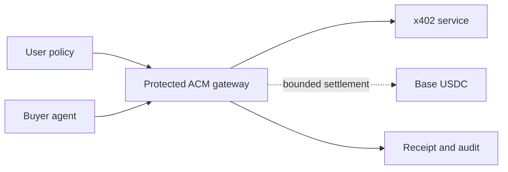

# Agent Capability Middleware

Give an AI agent permission to buy **one exact x402 resource** under a bounded grant—without giving the agent a wallet key.

**x402 moves money; ACM governs authority.**

> Developer preview. The protected buyer flow is implemented and tested on Base Sepolia. Seller and data-exchange helpers are experimental local previews; they do not settle payments or prove buyer demand.

Current release: [`v0.1.0-preview.24`](docs/releases/v0.1.0-preview.24.md).

Public CLI/SDK access is not public gateway access. See the [availability and integration matrix](docs/availability.md)
for package differences, current recipe coverage, and the private-dashboard boundary.

## Test ACM — no wallet required

Start with the [short tester guide](docs/test-acm.md): check the live catalog, inspect a local
synthetic buyer result, and tell us what worked or where you got stuck. No account or gateway
access is needed. Commands work in PowerShell and Bash; allow time for the first download.

[Send tester feedback](https://github.com/InTheta/agent-capability-middleware/issues/new?template=tester-feedback.yml).
A private Base Sepolia pilot is optional and separately arranged with an operator.

## No-spend catalog check

Requirements: Node.js 20+ and internet access. No clone, account, wallet, or private key is required.

```bash
npx --yes https://github.com/InTheta/agent-capability-middleware/archive/refs/tags/v0.1.0-preview.24.tar.gz doctor \
  > acm-no-spend-report.json
```

Success means the report contains:

```json
{
  "ok": true,
  "mode": "live_no_spend",
  "canonicalRoutes": 9,
  "spent": false,
  "secretsIncluded": false
}
```

The check reads Coinbase's public x402 Bazaar catalog, confirms all nine canonical Omni routes, and validates the current `0.010` Base Sepolia USDC market-risk quote. It creates no signature or payment.

## Local synthetic buyer preview

```bash
npx --yes https://github.com/InTheta/agent-capability-middleware/archive/refs/tags/v0.1.0-preview.24.tar.gz demo buyer
```

The deterministic preview validates a fresh, schema-matched synthetic paid result. It does not create or revoke a real grant, contact a seller, or settle a payment. Any `0xmock_...` receipt is deliberately not a chain transaction. Grant creation, revocation, and denial are checked separately in the controlled paid test.

## Install as a dependency

```bash
npm install github:InTheta/agent-capability-middleware#v0.1.0-preview.24
```

```ts
import {
  AgentCapabilityClient,
  createOmniPaymentRequest,
  createOmniX402Recipe,
  requireFreshPaidResult,
} from "@agent-capability-middleware/sdk";

const acm = new AgentCapabilityClient(process.env.ACM_GATEWAY_URL!, {
  apiKey: process.env.ACM_API_KEY,
});

const recipe = createOmniX402Recipe({ kind: "market_risk", symbol: "BTC" });
const request = createOmniPaymentRequest(
  "grant_approved_by_user",
  recipe,
  crypto.randomUUID(),
);

const result = await acm.consumeX402Testnet(request);
const data = requireFreshPaidResult(result, { expectedSchema: recipe.schema });
```

The gateway—not the SDK or agent—holds the payer key. It checks the grant, exact URL, purpose, amount, network, asset, payee, expiry, idempotency key, approval state, and revocation state before settlement.

## Optional private testnet pilot

This is not a public signup or part of the no-wallet test. Express interest through the tester
feedback form; an operator must separately arrange protected access and confirm a dedicated
Base Sepolia payer is ready. Only then follow the [private-pilot checklist](docs/design-partner-checklist.md).
The pilot checks a real testnet purchase, fresh schema-matched response, receipt, revocation,
and denial before a second settlement. Return reviewed reports privately to your operator.
No mainnet funds or payer keys are needed from a tester.

## What you can build now

| Goal | Command or guide | Status |
|---|---|---|
| Validate all nine live Bazaar routes without paying | `acm doctor` | Implemented |
| Inspect one live Bazaar route without paying | `acm inspect` | Implemented |
| Build exact calls across all nine Omni x402 products | `acm recipes` | Implemented |
| Buy through a protected, policy-bound payer | [Getting started](docs/getting-started.md) | Implemented on Base Sepolia |
| Buy a bounded Omni MCP tool through the protected payer | [`consumeX402McpTestnet`](docs/sdk-api.md#consume-a-paid-mcp-tool) | Implemented on Base Sepolia |
| Charge agents for a developer API | `acm demo developer-seller` | Experimental local offer helper |
| Offer a user-confirmed minimum-disclosure capability | `acm demo user-seller` | Experimental local offer helper |
| Compare both offer types | `acm demo exchange` | Experimental local directory |

The nine canonical Omni templates cover targeted and market-wide AI news, exact time windows,
all bounded liquidation views, all seven trader ranks, public trader-profile projections,
15/60-minute composite market risk, candles with optional liquidation overlay, current market
entity resolution, and current funding/carry. `acm recipes`
prints 25 concrete no-spend request plans over those templates; it does not claim 25 Bazaar
listings.

## Architecture


```mermaid
flowchart LR
    U["User policy"] --> G["Protected ACM gateway"]
    A["Buyer agent"] --> G
    G --> X["x402 service"]
    G -. "bounded settlement" .-> B["Base USDC"]
    G --> L["Receipt and audit"]
```

MCP can carry tool calls, OAuth/OIDC can identify workloads and users, verifiable credentials can carry attestations, and x402 carries payment requirements and proofs. ACM composes existing standards rather than replacing them. The protected gateway now applies the same exact grant and payment binding to four bounded Omni MCP tools.

## Experimental seller previews

ACM also explores the other side of the market: a developer can describe a paid API, and a user can offer a confirmed, minimized capability under **Free, Paid, Ask, or Deny** policy. These helpers are useful for product design and local testing, but they are not yet hosted settlement, fulfilment, an auction, or a production data marketplace.

```bash
npx --yes https://github.com/InTheta/agent-capability-middleware/archive/refs/tags/v0.1.0-preview.24.tar.gz demo developer-seller
npx --yes https://github.com/InTheta/agent-capability-middleware/archive/refs/tags/v0.1.0-preview.24.tar.gz demo user-seller
npx --yes https://github.com/InTheta/agent-capability-middleware/archive/refs/tags/v0.1.0-preview.24.tar.gz demo exchange
```

See [runnable examples](docs/examples.md) and the [user seller preview](docs/user-seller-agent.md).

## Verify the repository

```bash
git clone https://github.com/InTheta/agent-capability-middleware.git
cd agent-capability-middleware
npm ci
npm run verify
```

Verification type-checks the SDK and a consumer, runs the test suite and privacy checks, exercises the examples, packs and installs the package in a clean temporary project, and checks the CLI and fresh-developer lifecycle.
CI also rebuilds the committed `dist/` directory and fails if the shipped GitHub-install artifact
does not exactly match the TypeScript source.

## Boundaries

This repo contains the public SDK, request builders, local evidence minimizer, experimental offer helpers, examples, and tests. It does **not** contain private keys, a hosted vault, production identity verification, a live user-data marketplace, guaranteed user revenue, or a production fraud/risk control plane.

## Documentation

- [Test ACM — no wallet required](docs/test-acm.md)
- [Getting started](docs/getting-started.md)
- [Runnable examples](docs/examples.md)
- [Omni agent recipes](docs/omni-agent-recipes.md)
- [SDK API](docs/sdk-api.md)
- [x402 integration](docs/x402-integration.md)
- [Architecture](docs/architecture.md)
- [Privacy-safe learning](docs/privacy-safe-learning.md)
- [Security](SECURITY.md)
- [Roadmap](docs/roadmap.md)

Apache-2.0 licensed.
