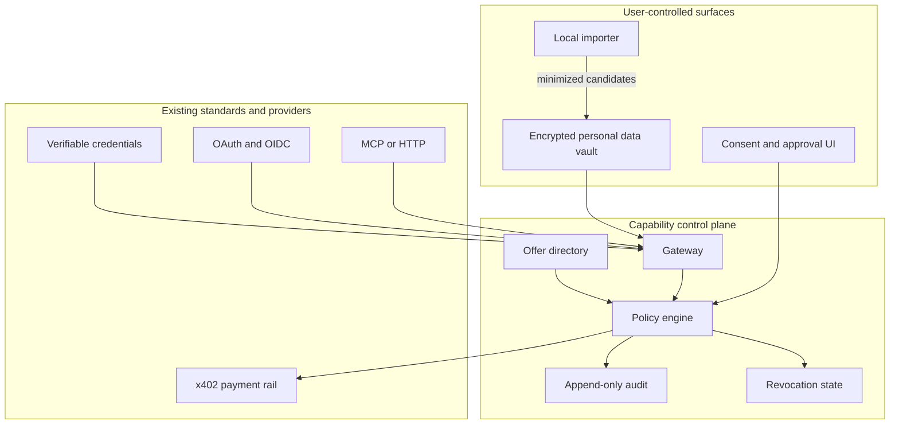

# Reference Architecture

Agent Capability Middleware is a policy layer, not a replacement for HTTP, MCP, OAuth, verifiable credentials or x402.

## Request outcomes

Every protected request resolves to one explicit outcome:

- `allow` — return the minimum scoped result;
- `deny` — return no protected data or action;
- `requires_approval` — wait for a human decision;
- `payment_required` — return or process an x402 challenge only after policy permits it.

## Core objects

- **Agent identity:** identifies the requesting software and developer.
- **Grant:** user-approved scopes, denials, expiry and optional resource/spend limits.
- **Memory candidate:** derived information awaiting user confirmation.
- **Confirmed attribute:** versioned user-controlled context available through grants.
- **Capability:** short-lived evidence that a specific action is allowed.
- **Offer:** a developer API or user-confirmed projection with purpose, audience, retention and
  Free/Paid/Ask/Deny terms. The public directory is an in-memory preview, not a settlement service.
- **Audit event:** redacted record of a policy decision.

## Deployment boundary

The SDK may run in browsers, desktop applications, agents or backend services. Sensitive policy enforcement must occur in a trusted gateway. Local importers should minimize source data before transmission. Payment signing must remain in a separately protected wallet component.

Developer sellers operate their x402 resource server and receive payment at their configured
address. User-side offers expose only a confirmed projection; a future hosted fulfilment service
will release it only after policy and payment validation. The public SDK owns neither payer nor
receiver keys.
