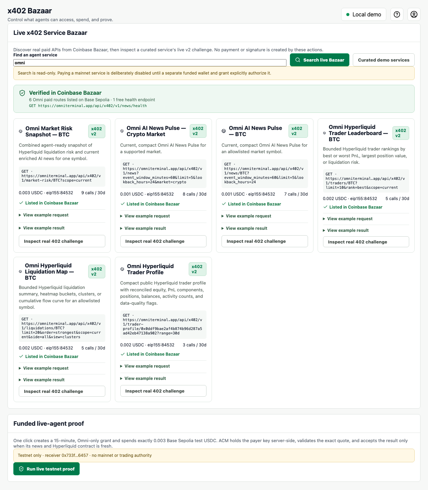
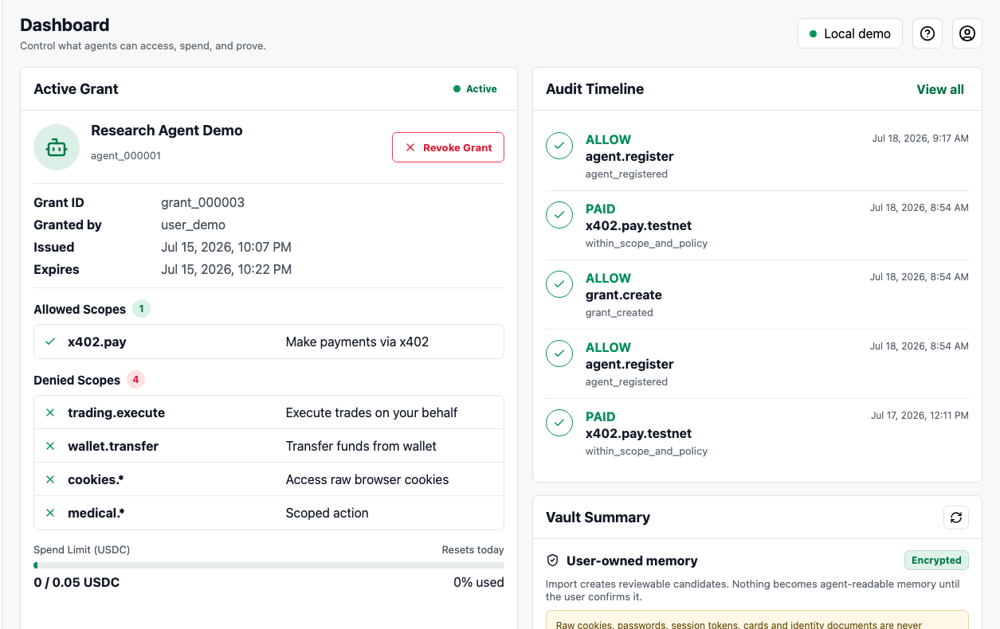
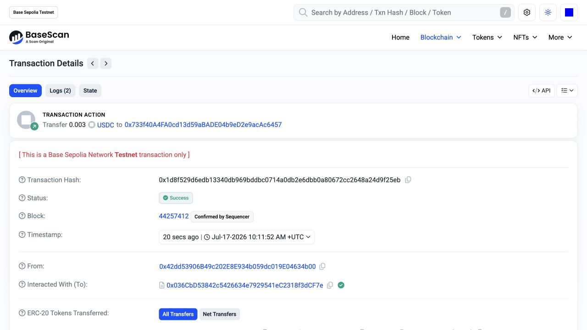

# Runnable examples

## One-command previews

No clone, account, private key, or payment:

```bash
npx github:InTheta/agent-capability-middleware#main demo buyer
npx github:InTheta/agent-capability-middleware#main demo developer-seller
npx github:InTheta/agent-capability-middleware#main demo user-seller
npx github:InTheta/agent-capability-middleware#main demo exchange
```

| Flow | What it proves | What it does not claim |
|---|---|---|
| Buyer | A paid, fresh response can be validated before agent use | The synthetic receipt moved money |
| Developer seller | A paid API offer produces exact payment terms | The SDK is itself an x402 facilitator |
| User seller | Confirmed, minimized data can become a policy-bound offer | Live buyer demand, earnings, or settlement |
| Exchange | Developer and user offers share one fixed-price decision model | A live auction or production marketplace |

## Repository examples

```bash
git clone https://github.com/InTheta/agent-capability-middleware.git
cd agent-capability-middleware
npm ci
```

External testers should use `acm partner-check` from the pinned GitHub preview instead of cloning;
the repository examples below are for contributors and deeper inspection.

### Buyer: clean external install

```bash
npm run example:fresh-dev
```

The runner packs the SDK, installs it into an empty temporary project, starts a deterministic mock gateway, creates a bounded grant, validates the result, revokes the grant, and proves another request is denied without a second receipt.

Expected marker: `FRESH_DEV_MOCK_OK`.

### Developer sells an API

```bash
npm run example:developer-seller
```

Expected decision:

```json
{
  "decision": "payment_required",
  "amountUsdc": 0.002,
  "network": "eip155:84532",
  "resource": "https://api.example.com/x402/weather-risk"
}
```

Expected marker: `DEVELOPER_SELLER_PREVIEW_OK`.

### User sells a minimum-disclosure capability

```bash
npm run example:user-seller
```

The example locally converts an Amazon-shaped CSV into aggregate signals, then publishes a confirmed running-shoe intent. Its output explicitly records:

```json
{
  "rawRowsPublished": false,
  "privacy": {
    "rawRowsRetained": false,
    "rawProductTitlesUploaded": false,
    "cookiesRead": false
  },
  "settled": false
}
```

Expected marker: `USER_SELLER_PREVIEW_OK`.

### Data exchange

```bash
npm run example:exchange
```

The directory returns `payment_required` for a paid developer API and `requires_user_approval` for an Ask-policy user capability.

Expected marker: `DATA_EXCHANGE_PREVIEW_OK`.

### Public Bazaar discovery

```bash
npm run example:bazaar
```

This reads Coinbase’s public x402 discovery API and does not pay. It ends with `BAZAAR_DISCOVERY_NO_SPEND_OK`.



### Real Omni agent recipes

```bash
npm run example:omni-recipes
```

This builds a least-privilege grant and exact request plans for the real Omni news, liquidation,
trader and market-risk products. It spends nothing and ends with
`OMNI_AGENT_RECIPES_NO_SPEND_OK`. See [the recipe guide](omni-agent-recipes.md).

## Real Base Sepolia purchase

Only run this after an ACM operator provides a controlled gateway credential and confirms the protected payer has test USDC:

```bash
ACM_GATEWAY_URL=https://your-protected-gateway.example \
ACM_API_KEY=server_only_workload_credential \
ACM_CONFIRM_TESTNET_SPEND=yes \
npm run partner:check
```

The flow pins the resource, amount, Base Sepolia network, USDC contract, Omni recipient, category, purpose, grant, and idempotency key. It accepts the result only when paid, receipted, fresh, and schema-matched, then revokes the grant and proves a new request is denied.

Expected markers:

```text
OMNI_X402_PAID_FRESH_OK
OMNI_X402_REVOKED_DENY_OK
```





The captures are testnet evidence, not mainnet or production claims.
