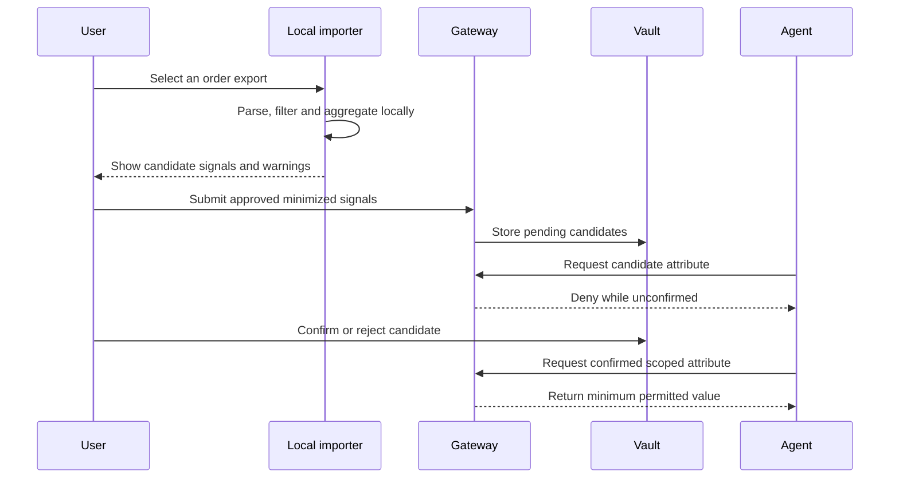

# Privacy-Safe Learning

The vault should become useful without requiring users to type every preference manually. That does not justify copying browser cookies or uploading unrestricted histories.

## Evidence pipeline

## Current shopping importer

The SDK accepts user-selected CSV exports with common product, brand, category, colour, size, price and date columns. Processing occurs in the calling environment.

Uploaded fields are limited to:

- signal kind;
- normalized value;
- evidence count;
- last observed month;
- number of locally processed rows.

The request excludes:

- raw product titles;
- order and tracking identifiers;
- delivery addresses;
- payment details;
- browsing cookies and session tokens;
- raw source rows.

Potentially sensitive categories are excluded before aggregation. This filter is intentionally conservative and must be extended and evaluated before additional data sources are supported.

## Confidence and confirmation

Derived data is a candidate, not a fact. Each candidate needs provenance, confidence, an explanation and review status. Agents may read only confirmed attributes covered by a live grant.

## Future importer rules

Email, calendar, browser and retailer connectors should follow the same boundary:

1. explicit user connection and source selection;
2. local or tightly isolated extraction where feasible;
3. minimum structured evidence;
4. visible preview;
5. confirmation for meaningful attributes;
6. per-attribute deletion, provenance and history;
7. no raw secret or cookie export.
