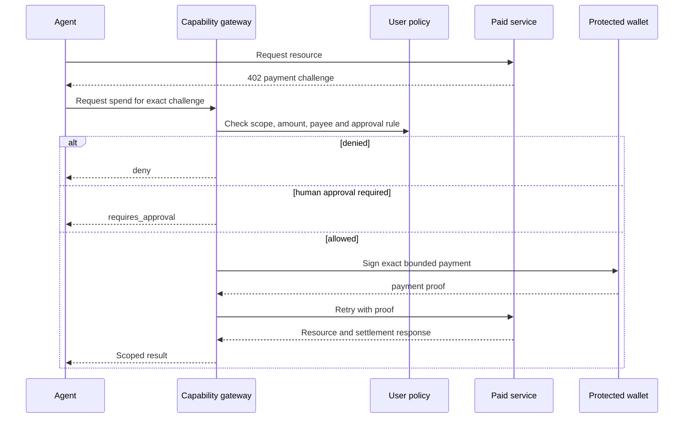

# x402 Integration

x402 describes how an HTTP resource can request and verify payment. Agent Capability Middleware adds user and developer policy around that exchange.



## Required bindings

Before signing, a production integration should bind permission to:

- scheme and network;
- atomic amount and asset contract;
- recipient;
- request method and normalized resource;
- purpose and category;
- expiry;
- unique idempotency key;
- the active user, agent and grant.

Budget should be reserved transactionally before signing. Ambiguous settlement needs reconciliation rather than an automatic retry with a new payment.

## Preview behavior

Public resource discovery and challenge inspection are read-only. The public reference server does not sign or settle payments. Funded testnet execution belongs in a protected gateway deployment and must never require placing a private key in this SDK repository.

The standalone `searchCdpX402Bazaar` and `listCdpX402MerchantResources` helpers call Coinbase's public discovery API without credentials. A seller appears only after it declares valid Bazaar metadata and settles through the CDP facilitator; an x402.org test settlement is not a CDP listing.

The SDK method `payQuotedX402Testnet` calls such a gateway. It does not sign locally.

## Real Omni example

Omni Terminal exposes two compact Base Sepolia products:

| Product | Resource | Price |
|---|---|---:|
| AI News Pulse | `/api/x402/v1/news/{symbol}?limit=5` | `0.001` test USDC |
| Trader Profile | `/api/x402/v1/trader-profile/{address}?range=30d` | `0.002` test USDC |

Create a grant that allows only `x402.pay`, category `market_intelligence`, domain `dev.omniterminal.app`, and a small USDC cap. Then run:

```bash
ACM_GATEWAY_URL=http://127.0.0.1:8787 \
ACM_CONFIRM_TESTNET_SPEND=yes \
OMNI_X402_RESOURCE_URL='https://dev.omniterminal.app/api/x402/v1/news/BTC?limit=5' \
npm run example:omni-x402
```

Without `ACM_CONFIRM_TESTNET_SPEND=yes`, the example performs only the public CDP merchant lookup. `ACM_GATEWAY_URL` identifies the protected buyer gateway. `OMNI_X402_RESOURCE_URL` identifies the seller. Never set either variable to a wallet private key.

On 15 July 2026, the funded ACM payer completed both purchases. The Base Sepolia receipts have status `1`:

- AI News Pulse: [`0x160b…fe1d`](https://sepolia.basescan.org/tx/0x160b9fc0216a3dbb1eb1582acf45603b308bfe217690ce26f5aebc265b4efe1d)
- Trader Profile: [`0x845c…ab59`](https://sepolia.basescan.org/tx/0x845ca7f06792bf82ffd85b45bc1bb2a6fe7939c7e51e9cdffe4a0618a9f2ab59)

The current stable dev hostname is otherwise protected by Cloudflare Access. External clients will not see the seller's `402` until the operator creates a separate path-scoped Access application for `dev.omniterminal.app/api/x402/*`. Do not use a temporary tunnel URL as a public default.

## Client safety checklist

- Use a unique idempotency key per logical purchase.
- Keep the grant short-lived and limited to the exact domain/category and a low testnet cap.
- Inspect or log only redacted settlement metadata, never the payment signature.
- Treat denial, approval-required, and uncertain settlement as distinct states.
- Do not automatically retry a payment with a new idempotency key.
- Keep this example out of automated test and package lifecycle scripts.
