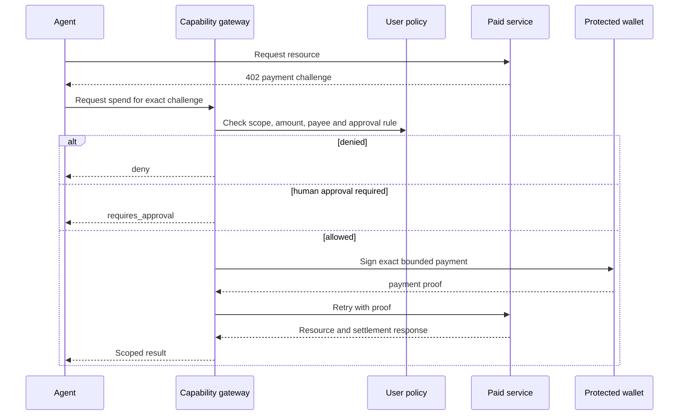

# x402 Integration

x402 describes how an HTTP resource can request and verify payment. Agent Capability Middleware adds user and developer policy around that exchange.

## Required bindings

Before signing, a production integration should bind permission to:

- scheme and network;
- atomic amount and asset contract;
- recipient;
- request method and normalized resource;
- purpose and category;
- expiry;
- unique idempotency key;
- the active user, agent and grant.

Budget should be reserved transactionally before signing. Ambiguous settlement needs reconciliation rather than an automatic retry with a new payment.

## Preview behavior

Public resource discovery and challenge inspection are read-only. The public reference server does not sign or settle payments. Funded testnet execution belongs in a protected gateway deployment and must never require placing a private key in this SDK repository.
