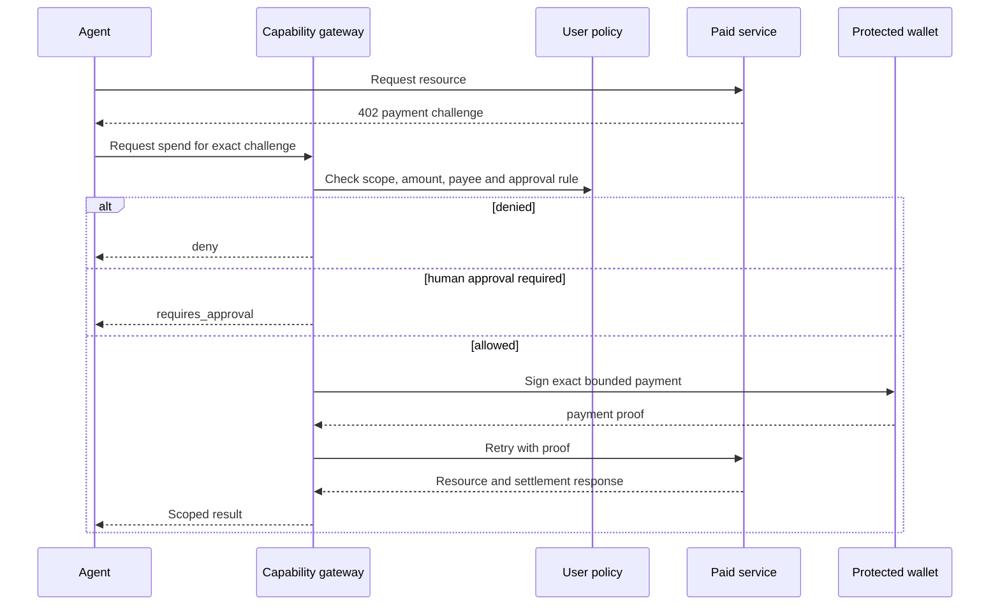

# x402 Integration

x402 describes how an HTTP resource can request and verify payment. Agent Capability Middleware adds user and developer policy around that exchange.



## Required bindings

Before signing, a production integration should bind permission to:

- scheme and network;
- atomic amount and asset contract;
- recipient;
- request method and normalized resource;
- purpose and category;
- expiry;
- unique idempotency key;
- the active user, agent and grant.

Budget should be reserved transactionally before signing. Ambiguous settlement needs reconciliation rather than an automatic retry with a new payment.

## Preview behavior

Public resource discovery and challenge inspection are read-only. The public reference server does not sign or settle payments. Funded testnet execution belongs in a protected gateway deployment and must never require placing a private key in this SDK repository.

The standalone `searchCdpX402Bazaar` and `listCdpX402MerchantResources` helpers call Coinbase's public discovery API without credentials. A seller appears only after it declares valid Bazaar metadata and settles through the CDP facilitator; an x402.org test settlement is not a CDP listing.

The SDK methods `payQuotedX402Testnet`, typed `consumeX402Testnet<T>`, `payQuotedX402<T>`, and
typed `consumeX402<T>` call such a gateway. They do not sign locally.

Revocation is part of the paid acceptance contract, not merely a dashboard feature. The canonical
runner revokes the grant after its successful purchase and proves a new request is rejected before
quote or settlement. A revoked grant must never be reactivated by paying again.

## Real Omni example

Omni Terminal currently exposes seven canonical Base Sepolia paid route forms:

| Product | Resource | Price |
|---|---|---:|
| AI News Pulse | `/api/x402/v1/news/{symbol}?limit=5` | `0.001` test USDC |
| Market News Pulse | `/api/x402/v1/news` | `0.001` test USDC |
| Public Trader Profile | `/api/x402/v1/trader-profile/{address}` | `0.002` test USDC |
| Liquidation Map | `/api/x402/v1/liquidations/{symbol}` | `0.002` test USDC |
| Trader Leaderboard | `/api/x402/v1/traders/{symbol}` | `0.002` test USDC |
| Market Risk Snapshot | `/api/x402/v1/market-risk/{symbol}` | `0.003` test USDC |
| Market Snapshot | `/api/x402/v1/market-snapshot/{symbol}` | `0.003` test USDC |

Successful Omni responses expose `schema`, `generated_at`, `data_as_of`, and `freshness`. Consumers
using a current route should fail closed unless `freshness.status` is `fresh`; an exact historical
news window may deliberately report `historical`. The composite market-risk response includes
component freshness for both its live Hyperliquid projection and news context.

The installed acceptance runner creates a 15-minute grant restricted to `x402.pay`, category
`market_intelligence`, domain `omniterminal.app`, and the exact canonical quote. Run its read-only
phase first:

```bash
npx --yes https://github.com/InTheta/agent-capability-middleware/archive/refs/tags/v0.1.0-preview.18.tar.gz partner-check \
  > acm-no-spend-report.json
```

Only after an ACM operator supplies controlled gateway access and confirms the dedicated testnet
payer is ready, explicitly arm one paid acceptance:

```bash
export ACM_GATEWAY_URL='https://provided-gateway.example'
export ACM_CONFIRM_TESTNET_SPEND=yes
npx --yes https://github.com/InTheta/agent-capability-middleware/archive/refs/tags/v0.1.0-preview.18.tar.gz partner-check \
  > acm-paid-report.json
unset ACM_API_KEY ACM_CONFIRM_TESTNET_SPEND
```

Use `consumeX402Testnet<T>()` when the agent needs a typed paid body and must validate that data
before acting. Pass current-data responses to `requireFreshPaidResult()` with the expected schema
to apply the SDK's standard paid, receipt, body, freshness, and schema checks. The helper does not
replace protected-gateway settlement reconciliation. `payQuotedX402Testnet()` remains supported
for compatibility; both call the same protected quoted-payment endpoint.

Without `ACM_CONFIRM_TESTNET_SPEND=yes`, the installed CLI performs only the public CDP merchant
lookup and writes a redacted report. `ACM_GATEWAY_URL` identifies the protected buyer gateway. The
partner check intentionally pins the canonical market-risk resource and must not be repurposed for
another priced route. Never set the gateway variable to a wallet private key.

The generated `design_partner_check.v3` report records only public receipt/audit identifiers and the
post-revoke `grant_revoked` denial. It omits the paid body and all secrets. The older
`OMNI_X402_PAID_FRESH_OK` and `OMNI_X402_REVOKED_DENY_OK` markers belong to the contributor-only v2
rehearsal and are not the external acceptance interface.

On 15 July 2026, the funded ACM payer completed the News Pulse purchase. The Base Sepolia receipt has status `1`:

- AI News Pulse: [`0x160b…fe1d`](https://sepolia.basescan.org/tx/0x160b9fc0216a3dbb1eb1582acf45603b308bfe217690ce26f5aebc265b4efe1d)
- Hyperliquid Market Snapshot: [`0x556a…62c2`](https://sepolia.basescan.org/tx/0x556aa441facaeeaabcd348787df237b4ca1346b5eeb0d88da1b25a7ebc2662c2)

A later opt-in catalog smoke paid 14 query variants: latest/context/window news, liquidation
summary/buckets/clusters/flow, best/worst/largest/risk traders, a public trader profile and the
composite market-risk snapshot. All 14 returned live protected results. On 21 July 2026, ACM then
settled the seventh Market Snapshot template and validated a fresh candle-plus-liquidation result;
the CDP receiver catalog now returns all seven route forms.


## Mainnet boundary

`consumeX402<T>` (or its `payQuotedX402<T>` alias) can target a mainnet challenge only when the protected gateway has a separate
mainnet payer, explicit network/asset/payee allowlists, durable budget/idempotency state and human
approval. Use `getMainnetWalletStatus` and `getMainnetWalletBalances` for public readiness checks.
Funding or enabling that payer remains a human action; the SDK never automates either one.
Always provide `expectedPayment` so a dual-network challenge cannot silently choose a different
chain, token or receiver.

The main and dev seller paths are public through a dedicated Cloudflare Access application scoped only to `/api/x402/*`; neither parent site is bypassed. Use the main domain as the public default and the dev domain for staging tests.

## Client safety checklist

- Use a unique idempotency key per logical purchase.
- Keep the grant short-lived and limited to the exact domain/category and a low testnet cap.
- Inspect or log only redacted settlement metadata, never the payment signature.
- Treat denial, approval-required, and uncertain settlement as distinct states.
- Do not automatically retry a payment with a new idempotency key.
- Keep this example out of automated test and package lifecycle scripts.
